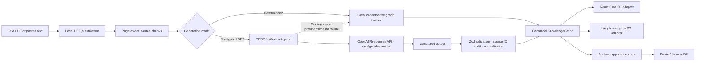
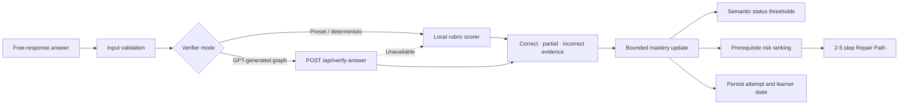

<h1 align="center">Synapse</h1>

<p align="center"><strong>Spatial Knowledge Twin</strong></p>

<p align="center">
  Turn dense educational documents into a living map of what the material means, what the learner knows, and what to repair next.
</p>

<p align="center">
  <code>OpenAI Build Week · Education Track</code>
  <code>React 19</code>
  <code>Strict TypeScript</code>
  <code>GPT-5.6 configurable</code>
  <code>MIT</code>
</p>

> **Why it matters:** reading is linear, but understanding is not. Synapse connects source-grounded knowledge structure with active-recall evidence so a learner can see not only where they are stuck, but which prerequisite to repair.

Synapse is a working local-first hackathon application. It opens with a curated 20-concept Machine Learning graph, requires no API key for its deterministic study loop, and keeps one canonical graph synchronized across focused 2D and exploratory 3D views.

## The problem

Dense textbooks and lecture notes present ideas one page at a time, while real knowledge is interconnected and prerequisite-based. Passive rereading can feel fluent without proving recall. When understanding breaks down, learners often know the current topic is difficult but cannot identify the upstream concept causing the gap.

## The solution: two connected twins

Synapse maintains two models that evolve together:

1. **The domain twin** — a source-grounded graph of concepts, relationships, citations, questions, and rubrics.
2. **The learner twin** — a local model of mastery probabilities, retrieval attempts, review state, prerequisite risk, and recommended repairs.

```text
Document -> Source-grounded graph -> Active recall -> Mastery update
         -> Prerequisite diagnosis -> Repair Path
```

The graph is not decoration around a summary. It is the shared structure used for inspection, assessment, mastery updates, risk propagation, and repair recommendations.

## Product experience

| Experience                     | Version 1.0 behavior                                                                                                                                                  |
| ------------------------------ | --------------------------------------------------------------------------------------------------------------------------------------------------------------------- |
| **3D Galaxy**                  | Lazy-loaded force graph for spatial exploration, selection, camera focus, semantic status color, directional links, and highlighted repair paths.                     |
| **2D Path**                    | Readable prerequisite layout with custom concept nodes, keyboard-accessible search, zoom, fit, filters, and the same selection and learner state as 3D.               |
| **Source-grounded inspector**  | Shows the concept summary, KaTeX formula when available, page and section citation, source excerpt, and explainable relationships.                                    |
| **Free-response verification** | Scores answers as correct, partial, or incorrect; reports covered and missing ideas; rejects fixture-tested contradictions; and provides a targeted hint when needed. |
| **Probabilistic mastery**      | Updates a bounded mastery estimate from answer evidence and derives Gap, Review, or Mastered status from explicit thresholds.                                         |
| **Repair Path**                | Traverses prerequisite edges, ranks weak upstream concepts, explains each recommendation, highlights the path, and starts study at the first repair step.             |
| **PDF and text ingestion**     | Extracts selectable PDF text locally with PDF.js, preserves page numbers in chunks, and also accepts pasted Markdown or plain text.                                   |
| **Local persistence**          | Stores validated graphs, learner state, attempts, view, filters, and reduced-motion preference in IndexedDB through Dexie, with an in-memory fallback.                |
| **Deterministic resilience**   | Curated presets, local graph generation, and a transparent local rubric scorer keep the core loop usable without credentials or when AI is unavailable.               |

## Visual walkthrough

The application has been visually checked at desktop and mobile widths, but public README screenshots are not yet committed. The exact capture states, filenames, dimensions, and accessibility requirements are documented in [the README asset checklist](docs/assets/README_ASSET_CHECKLIST.md).

No placeholder or unverified screenshot is embedded here.

## Why Synapse is different

| Common study tool   | What it usually models               | What Synapse adds                                                          |
| ------------------- | ------------------------------------ | -------------------------------------------------------------------------- |
| PDF summarizer      | A compressed version of the document | Source-grounded concepts, citations, questions, and explicit relationships |
| Chatbot over notes  | A conversational retrieval surface   | A persistent learner model changed by retrieval evidence                   |
| Static mind map     | Topic structure at one moment        | Synchronized 2D/3D views with evolving mastery and semantic status         |
| Flashcard generator | Independent prompts and answers      | Prerequisite-aware downstream risk and an explainable Repair Path          |

> **Central differentiation:** Synapse models both the knowledge structure and the learner's evolving mastery, then uses prerequisite-aware diagnosis to recommend what to repair.

## How it works

### Document to canonical graph



The browser validates file type and size, extracts PDF text locally, preserves page boundaries, hashes the text, and checks for a cached graph. In configured GPT mode, bounded source chunks go to a server-side route. Model output reaches the UI only after schema validation, supplied-source checks, duplicate handling, dangling-link removal, and normalization.

### Answer evidence to Repair Path



## Learner model

Each concept starts with a mastery probability. Correct, partial, and incorrect evidence produce different Bayesian-style updates; probabilities are clamped between `0.02` and `0.98`.

Status is derived rather than asserted by the model:

- **Gap:** mastery below `0.40`
- **Review:** mastery from `0.40` up to `0.80`
- **Mastered:** mastery at or above `0.80`

Prerequisite risk is ranked separately from mastery:

```text
risk(v) = own mastery gap + λ × weighted upstream prerequisite gaps
```

Risk never overwrites mastery. Repair ranking combines low prerequisite mastery, dependency weight, distance from the selected concept, and review urgency. When no weak prerequisite exists, Synapse recommends retrieving the selected concept again.

## Built with Codex and GPT-5.6

### Codex collaboration

The human-directed repository specification defined the product invariant, acceptance criteria, data contracts, learner model, visual direction, architecture constraints, and Education Track scope. Codex accelerated the implementation across:

- React and TypeScript architecture
- Canonical graph schemas and normalization
- 2D/3D renderer integration
- Local ingestion, persistence, and failure handling
- Learner-model and graph algorithms
- Unit, component, API-boundary, and end-to-end tests
- Debugging, browser verification, and documentation

This division matters: Codex translated explicit product decisions into a tested implementation; it did not replace the human product brief.

### GPT-5.6 inside the product

The optional full-stack path defaults to `gpt-5.6` through the server-side `OPENAI_MODEL` setting. The implemented OpenAI Responses API routes support:

1. **Structured knowledge-graph extraction** from bounded source chunks.
2. **Rubric-based answer verification** for GPT-generated graphs.

Both routes use structured output contracts. Zod, source-ID checks, normalization, domain verdict thresholds, and bounded fallback logic prevent raw model output from becoming application state. The recorded build did not perform a live-key smoke test, so the deterministic path is the verified judge experience.

## Quick start

### Prerequisites

- Node.js and npm compatible with Vite 8
- A modern browser with IndexedDB support
- Optional: an OpenAI API key for the configured full-stack path

The recorded verification environment used Node.js `26.0.0` and npm `11.12.1`.

### Frontend-only deterministic mode

No environment variables are required.

```bash
npm install
npm run dev
```

Open the local URL printed by Vite. The curated preset, local scoring, deterministic graph generation from pasted text, and local PDF text extraction remain available without an API key.

### Optional local full-stack mode

```bash
cp .env.example .env.local
npm run dev:full
```

Set `OPENAI_API_KEY` only in `.env.local`. It is server-side and must never use a `VITE_` prefix.

| Variable                  | Required | Runtime behavior                                                                         |
| ------------------------- | -------: | ---------------------------------------------------------------------------------------- |
| `OPENAI_API_KEY`          |       No | Enables server-side OpenAI requests; missing credentials produce deterministic fallback. |
| `OPENAI_MODEL`            |       No | Server-side model override; defaults to `gpt-5.6`.                                       |
| `OPENAI_TIMEOUT_MS`       |       No | Server request timeout; defaults to `20000`.                                             |
| `VITE_DETERMINISTIC_MODE` |       No | Forces answer verification to stay on the local scorer. Contains no secret.              |

### Verification commands

```bash
npm run lint
npm run typecheck
npm run test
npm run build
npm run test:e2e
```

To inspect the production bundle locally:

```bash
npm run build
npm run preview
```

## Judge quick test

This deterministic path is designed to be completed in roughly 60-90 seconds and requires no credentials.

1. In a fresh browser profile, start with `npm run dev`; the **Machine Learning** preset opens in **3D Galaxy** mode.
2. Search for and select **Backpropagation**. Confirm the formula, section `3.4 Backpropagation`, page `12`, and source excerpt are visible.
3. Switch between **3D Galaxy** and **2D Path**; confirm Backpropagation remains selected.
4. Submit this documented correct answer: `The chain rule composes local derivatives backward through every layer to calculate gradients for the weights.`
5. Observe the `correct` verdict and Backpropagation changing to **Mastered**.
6. Select **Vanishing Gradients** and submit this partial answer: `Repeated multiplication makes gradients shrink in deep networks.`
7. Select **Diagnose path**, inspect the upstream explanations, and choose **Start repair**.
8. Reload, search for Backpropagation, and confirm its mastery persisted.
9. Optionally upload [the original Synapse neural-networks sample PDF](docs/demo/Synapse_Sample_Neural_Networks.pdf) with **Deterministic demo mode** enabled.

## Verification and quality

Recorded results from the verified local build on 2026-07-21:

| Check                   | Result                                                                                          |
| ----------------------- | ----------------------------------------------------------------------------------------------- |
| ESLint                  | Passed with zero errors and warnings                                                            |
| Strict TypeScript       | Passed with zero TypeScript errors                                                              |
| Vitest                  | 8 files, 23 tests passed                                                                        |
| Production build        | Passed with Vite 8.1.5; large-chunk warnings remain documented                                  |
| Playwright              | 1 Chromium end-to-end test passed; 1.8 s test time, 2.2 s total                                 |
| Browser QA              | Verified at 1280×720 and 390×844, including formula rendering and responsive inspector behavior |
| Built-asset secret scan | No OpenAI-key-shaped value or `OPENAI_API_KEY` identifier found in built JavaScript             |

Coverage includes graph validation, dangling-link normalization, answer scoring, contradiction rejection, mastery bounds and thresholds, prerequisite risk, Repair Path validity, ingestion and page preservation, persistence serialization, UI behavior, API fallbacks, PDF upload, reload persistence, and simulated provider failure.

See [the detailed build status](docs/BUILD_STATUS.md) for exact recorded command and browser results.

## Privacy and resilience

- **Local extraction:** PDF text is extracted in the browser with PDF.js.
- **Bounded AI payloads:** only validated source chunks needed for generation are sent to `/api/extract-graph` when GPT mode is selected.
- **Server-side secrets:** OpenAI credentials stay in server environment variables and are never stored in browser state.
- **Local learner state:** graphs, attempts, mastery, and preferences are stored in IndexedDB by default and can be reset from Session Summary.
- **AI fallback:** missing credentials or extraction failures use a labeled deterministic graph path; answer-verification failures use the local rubric scorer.
- **Rendering fallback:** a 3D renderer failure exposes a useful 2D Path recovery action.
- **Storage fallback:** IndexedDB failure keeps the current session usable in memory with a warning.

## Version 1.0 scope

> **Version 1.0** focuses on a reliable individual learning loop for selectable-text educational PDFs, pasted Markdown/plain text, and curated presets. It is a local-first hackathon release, not a replacement for a learning-management system or an authoritative assessment platform.

Implemented in Version 1.0:

- Curated 20-concept Machine Learning preset
- Compact Neuroscience and Constitutional Law presets
- Source-grounded canonical graph shared by 2D and 3D renderers
- Free-response deterministic scoring and optional server-side verification
- Probabilistic mastery, review dates, prerequisite risk, and Repair Path
- Text-based PDF and pasted-text ingestion
- IndexedDB persistence with reset and in-memory fallback
- Responsive and reduced-motion-aware study interface

## Roadmap: from 1.0 to an education platform

Everything in this section is **planned future work**, not current functionality.

### Near-term: stronger document intelligence

- Better layout-aware PDF reading
- Tables, diagrams, equations, and scanned-document OCR
- Multimodal figure-to-concept relationships
- Improved section detection and citation alignment
- Duplicate-concept resolution across chapters
- Incremental graph updates for larger documents

### Near-term: smarter assessment

- More reliable semantic grading across paraphrases
- Misconception-specific rubrics
- Confidence calibration
- Multi-step questions and derivations
- Socratic hints that reveal less on early attempts
- Human or teacher override of AI verification
- Evaluation datasets for grading quality

### Medium-term: deeper learner modeling

- Personalized knowledge-tracing parameters
- FSRS-based review scheduling
- Uncertainty-aware mastery estimates
- Cross-document prerequisite graphs
- Learning-path optimization
- Longitudinal progress analytics

### Medium-term: teacher and classroom tools

- Teacher-authored concept graphs and rubrics
- Assignment and cohort dashboards
- Anonymous misconception analytics
- Curriculum standards mapping
- Export to LMS and flashcard formats
- Accessibility profiles and multilingual learning

### Long-term: business-grade platform

- Secure accounts and organizational workspaces
- Privacy, retention, audit, and data-governance controls
- Scalable background ingestion
- Team administration and billing
- Model routing and cost controls
- Observability and evaluation pipelines
- Enterprise SSO and LMS integrations
- Mobile and offline applications

## Limitations

- PDF ingestion is best with selectable text. Scanned PDFs require externally produced OCR text.
- Deterministic document generation conservatively treats source order as a possible prerequisite sequence and labels that limitation in the UI.
- Model-generated graphs pass structural and source-grounding validation, but educational relationships should still be reviewed critically.
- Free-response grading is study guidance, not an authoritative academic assessment.
- PDFs are limited to 20 MB and 100,000 extracted characters; pasted text is limited to 50,000 characters.
- Very large documents need future incremental processing.
- 3D responsiveness depends on the device and WebGL support; the 2D fallback remains available.
- The React Flow and force-graph bundles produce documented production chunk-size warnings.
- The configured GPT-5.6 route is implemented but was not verified with a live API key in the recorded build.

## Contributing

Focused issues and pull requests are welcome once the repository is published. Keep domain algorithms outside React components, preserve the canonical graph invariant, validate untrusted boundaries with Zod, and keep the deterministic no-key path working.

Before proposing a change, run:

```bash
npm run lint
npm run typecheck
npm run test
npm run build
npm run test:e2e
```

## License and acknowledgments

Synapse is available under the [MIT License](LICENSE).

The project uses React, Vite, Tailwind CSS, React Flow, react-force-graph-3d, Three.js, PDF.js, KaTeX, Lucide, canvas-confetti, Zod, Zustand, Dexie, the OpenAI JavaScript SDK, Vitest, Testing Library, Playwright, ESLint, Prettier, and Vercel tooling. See [official and primary references](docs/SOURCES.md) for the project documentation links.

The bundled [neural-networks sample PDF](docs/demo/Synapse_Sample_Neural_Networks.pdf) is original educational material created for this repository. The curated Machine Learning preset uses a synthetic source chapter created solely for deterministic demonstration.
