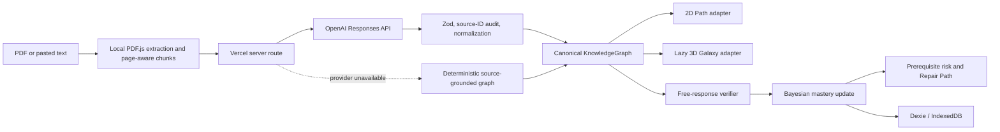

# Synapse · Spatial Knowledge Twin

Synapse turns educational material into a source-grounded concept graph and maintains a parallel learner model: what the learner appears to know, which prerequisite gaps create downstream risk, and what to repair next.

It is a working React application—not a PDF summarizer or static mind map. The deterministic Machine Learning preset opens without credentials and supports the complete study loop: explore, inspect evidence, answer from memory, update mastery, diagnose prerequisite risk, activate a Repair Path, and review the session.

## What is different

- One canonical graph drives synchronized 2D Path and lazy-loaded 3D Galaxy views.
- Every concept carries a page-level citation, source excerpt, question, and rubric.
- Free-response evidence is scored as correct, partial, or incorrect; contradictions are not accepted as keyword matches.
- A Bayesian-style learner model updates bounded mastery probabilities.
- Prerequisite risk is computed separately from mastery and produces an explainable repair path.
- IndexedDB stores validated graphs, learner state, attempts, filters, view and motion preferences.
- PDF extraction happens locally; AI calls, when configured, go only through server-side routes.
- Missing credentials, provider errors, malformed output, IndexedDB failure, and WebGL failure all have deterministic recovery paths.

## Codex and GPT-5.6

This repository was implemented by Codex from the checked-in product, acceptance, data, AI, design, and architecture contracts. The implementation session produced the domain model, UI, server routes, tests, release documentation, and evidence-based build status.

At runtime, GPT-5.6 is configured through `OPENAI_MODEL` and the OpenAI Responses API for:

1. strict, source-grounded knowledge-graph extraction; and
2. rubric-based free-response verification.

Model output is never trusted directly: request and response schemas are validated with Zod, source IDs are checked, duplicates are merged conservatively, dangling relationships are removed, and one bounded repair attempt precedes deterministic fallback. The UI never labels fallback output as GPT-generated.

## Quick start

Requirements: Node.js 24+ and npm 11+ (the build session used Node 26.0.0 and npm 11.12.1).

```bash
npm install
cp .env.example .env.local
npm run dev
```

Open the local URL printed by Vite. No environment variables are required for the curated preset, local scoring, or deterministic text ingestion.

For Vercel-compatible local API routes:

```bash
npm run dev:full
```

## Environment variables

| Variable | Required | Purpose |
|---|---:|---|
| `OPENAI_API_KEY` | No | Server-only OpenAI credential. Never use a `VITE_` prefix. |
| `OPENAI_MODEL` | No | Defaults to `gpt-5.6`; use another account-supported model when necessary. |
| `OPENAI_TIMEOUT_MS` | No | Server request timeout; defaults to 20,000 ms. |
| `VITE_DETERMINISTIC_MODE` | No | Forces client verification to use the local scorer. Contains no secret. |
| `VITE_SIMULATE_API_FAILURE` | No | Reserved non-secret demo/test control. |

## Commands

```bash
npm run lint
npm run typecheck
npm run test
npm run build
npm run test:e2e
```

See [docs/BUILD_STATUS.md](docs/BUILD_STATUS.md) for exact command results, browser evidence, and explicitly deferred release work.

## Architecture



Core boundaries:

- `src/domain/`: pure graph, scoring, mastery, risk, repair, and ingestion logic.
- `src/stores/`: Zustand orchestration; educational graph data remains renderer-independent.
- `src/storage/`: strict persisted-state validation with an in-memory fallback.
- `src/components/`: app shell, canvas adapters, source-grounded inspector, ingestion, and summary surfaces.
- `api/`: server-only OpenAI client, prompts, structured-output routes, error handling, and fallback.

## Privacy and security

- PDF text extraction runs in the browser through PDF.js.
- Only bounded chunks needed for graph generation are sent to `/api/extract-graph` in GPT mode.
- Learner answers are sent to `/api/verify-answer` only for GPT-generated graphs when deterministic mode is off.
- API keys remain server-side and are never persisted in the browser.
- Learner state is local-first in IndexedDB and can be reset from Session Summary.
- Uploaded text is treated as untrusted prompt content; server prompts explicitly ignore instructions embedded in source material.

## Deployment

1. Import the repository into Vercel.
2. Keep the framework preset as Vite.
3. Add `OPENAI_API_KEY` and, optionally, `OPENAI_MODEL` and `OPENAI_TIMEOUT_MS` in project settings.
4. Deploy. The `api/` directory is detected as Vercel Functions and `npm run build` produces the frontend.
5. Verify deterministic mode before adding credentials; then smoke-test both API routes without logging document content.

The frontend can also be hosted statically, but GPT routes will be unavailable and the app will intentionally remain in curated/deterministic mode.

## Suggested two-minute-fifty-second demo

1. **0:00–0:20** — Explain why linear rereading hides prerequisite gaps.
2. **0:20–0:45** — Open the Machine Learning 3D Galaxy and point out semantic mastery states.
3. **0:45–1:25** — Switch to 2D, select Backpropagation, show page 12 and the formula, then answer with the chain rule.
4. **1:25–1:55** — Select Vanishing Gradients, activate Repair Path, and start the first weak prerequisite.
5. **1:55–2:20** — Paste a short document, show local extraction, and explain optional GPT-5.6 structured extraction.
6. **2:20–2:45** — Open Session Summary and describe React, Zod, Dexie, PDF.js, React Flow, Three.js, Codex, and GPT-5.6.
7. **2:45–2:58** — Close on the learner-twin differentiator.

## Screenshots

The implementation was visually verified at 1280×720 and 390×844 after the browser acceptance flow passed. Those QA captures were intentionally kept outside the repository; capture fresh production screenshots after deployment for the Devpost gallery.

## Third-party acknowledgments

Synapse uses React, Vite, Tailwind CSS, React Flow, react-force-graph-3d, Three.js, PDF.js, KaTeX, Lucide, canvas-confetti, Zod, Zustand, Dexie, the OpenAI JavaScript SDK, Vitest, Testing Library, Playwright, ESLint, Prettier, and Vercel tooling. Their respective licenses apply.

## License

MIT. See [LICENSE](LICENSE).
